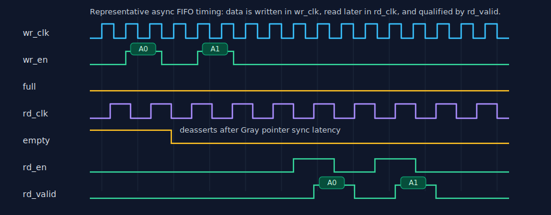

# 异步 FIFO

[English](README.md)

一个偏学习导向的紧凑异步 FIFO RTL 项目，包含 CDC 约束、wrapper、仿真/形式验证
和一个简单的 PYNQ-Z2 板级 demo。

[怎么用](#我应该使用哪个模块) ·
[文档目录](docs/README.md) ·
[逐步教程](docs/tutorial_CN.md) ·
[Cummings 映射](docs/cummings_mapping_CN.md) ·
[原理深读](docs/learning_async_fifo_CN.md) ·
[形式验证](docs/formal_verification_CN.md) ·
[XPM 对比](docs/xpm_fifo_async_comparison_CN.md) ·
[FWFT 设计](docs/fwft_design_CN.md) ·
[接口](docs/interface.md) ·
[架构](docs/architecture.md) ·
[CDC 约束](docs/cdc_constraints.md) ·
[板级 demo](docs/pynq_z2_vivado.md) ·
[限制与签核状态](#限制与签核状态) ·
[English](README.md)

## 我应该使用哪个模块？

| 需求 | 模块 | 角色 |
|---|---|---|
| 小型等宽异步 FIFO | `async_fifo` | **从这里开始。** 最小公开用户入口 |
| 等宽 FIFO，并需要 first-word fallthrough | `async_fifo_fwft` | 可选 FWFT 读侧 wrapper |
| 写读位宽不同 | `async_fifo_width_conv` | 可选位宽转换 wrapper |
| 带 `keep`、`last` 的 `ready/valid` 流接口 | `async_fifo_stream` | 可选分包流 wrapper |

大多数用户应该实例化 `async_fifo`。最小完整例子见
[`examples/basic_fifo/`](examples/basic_fifo/)。另外两个模块放在
`rtl/wrappers/` 下，明确表示它们是在同一个等宽 core（内核）外面增加协议行为。

端口、复位、almost flag（预警标志）和 occupancy（占用量）语义集中在
[接口与时序](docs/interface.md)。
实现层次见[架构说明](docs/architecture.md)。如果你想通过这个项目学习异步 FIFO
原理，而不仅是使用 IP，建议先看[逐步教程](docs/tutorial_CN.md)，再看
[学习异步 FIFO](docs/learning_async_fifo_CN.md)。

## 学习路线图

| 读者 | 先看 | 再看 |
|---|---|---|
| 第一次学异步 FIFO | [逐步教程](docs/tutorial_CN.md) | [Cummings 风格 FIFO 映射](docs/cummings_mapping_CN.md) |
| RTL 集成者 | [我应该使用哪个模块？](#我应该使用哪个模块) | [接口与时序](docs/interface.md) |
| RTL 阅读者 | [Cummings 风格 FIFO 映射](docs/cummings_mapping_CN.md) | [学习异步 FIFO](docs/learning_async_fifo_CN.md) |
| 验证读者 | [学习异步 FIFO](docs/learning_async_fifo_CN.md) | [形式验证指南](docs/formal_verification_CN.md) |
| Vendor IP 对比读者 | [接口与时序](docs/interface.md) | [XPM_FIFO_ASYNC 对比](docs/xpm_fifo_async_comparison_CN.md) |
| 未来 FWFT 贡献者 | [接口与时序](docs/interface.md) | [FWFT / Fallthrough 设计说明](docs/fwft_design_CN.md) |
| CDC/时序审阅者 | [架构说明](docs/architecture.md) | [CDC 约束](docs/cdc_constraints.md) |
| 板级流程使用者 | [简单板级 demo](#简单板级-demo) | [PYNQ-Z2 Vivado 验证](docs/pynq_z2_vivado.md) |

内核异步 FIFO 结构参考 Cummings/Sunburst 经典风格：本地二进制指针用于地址和
算术，跨域前转换为格雷码指针，经过两级同步后在本地时钟域产生 `full`/`empty`。
RTL 对应关系见 [Cummings 风格 FIFO 映射](docs/cummings_mapping_CN.md)，论文链接见
[理论参考](#理论参考)。

## 架构速览


core 保持等宽并负责真正的 CDC 机制。位宽转换和 stream 分包行为都作为 wrapper
包在同一个 core 外面。

## 波形快照



写时钟和读时钟互不相关。数据在写时钟域写入；读时钟域经过格雷码指针同步延迟后
看到可读数据；消费者必须用 `rd_valid` 限定返回数据。

## 简单板级 demo

PYNQ-Z2 示例为 `xc7z020clg400-1` 构建了一个可综合 smoke test：100 MHz 写时钟和
75 MHz 读时钟通过 FIFO 搬运计数序列。LED0 是 sticky mismatch 指示，LED2 只有在
持续成功读取时才会闪烁，LED3 表示 MMCM locked。

```bash
make pynq-z2
```

bitstream 路径、报告检查项、LED 行为和 Vivado 2025.2 验证结果见
[PYNQ-Z2 Vivado 验证](docs/pynq_z2_vivado.md)。

## 限制与签核状态

这是一个经过较完整检查、适合复用和学习的项目，但不是覆盖所有产品场景的
production sign-off 包。

- FIFO 深度必须是 2 的幂。
- 位宽转换只支持整数 2 次幂比例。
- 复位是破坏性的；不支持运行中单侧复位并保留数据。
- almost 标志和 occupancy 只是本地时钟域流控视图，不是全局瞬时快照。
- 开源仿真/形式验证是有界、参数抽样的检查。
- Xilinx 约束已在仓库内 Vivado 流程做实现验证；Intel 约束是模板。
- 真实产品仍需要针对目标器件、时钟和集成方式完成 STA、CDC、reset、DRC 和
  methodology review。

## 使用前必读

这个仓库提供四个可综合 FIFO 入口，选择接口时应先确定事务语义：

- `async_fifo`：等宽、请求式读写；
- `async_fifo_fwft`：等宽、读侧 first-word fallthrough 行为；
- `async_fifo_width_conv`：整数 2 次幂比例的请求式位宽转换；
- `async_fifo_stream`：带 `ready/valid`、`keep` 和 `last` 的分包流接口，
  推荐用于新的流式集成。

仓库还提供 `async_reset_sync`，用于在单个时钟域中实现复位异步断言和
同步撤销。

集成前必须理解以下契约：

1. **传输判定**：请求式接口只在 `wr_rstn && wr_en && !full` 或
   `rd_rstn && rd_en && !empty` 的本地时钟沿接受请求，读取结果必须用 `rd_valid`
   限定；流式接口只在 `valid && ready` 时完成传输。
2. **复位语义**：`wr_rstn`、`rd_rstn` 为低有效异步复位输入。复位可以
   异步断言（拉低），但必须由集成方分别在本地时钟域同步撤销（拉高）。复位
   是破坏性的；两侧完成协调初始化前不得传输，运行中单侧复位并保留数据
   不在支持范围内。
3. **深度与位宽**：core（内核）深度必须是 2 的幂；变宽比例必须是整数 2 次幂，
   且 `ADDR_WIDTH` 必须足以产生至少 2 个内部宽字。
4. **容量单位**：`ADDR_WIDTH` 描述 core RAM 的窄字等效容量，不包含
   wrapper 的拼包、pending、拆包和预取槽。`wr_core_used/rd_core_used`
   只统计 core，不是整个模块的在途拍数。
5. **本地状态视图**：`full`、`empty`、`almost_full/almost_empty` 和占用量都在各自
   时钟域产生。远端指针同步延迟会使它们保守地延迟撤销；它们不是同一时刻
   的全局占用快照。almost 标志仅用于提前流控，不能替代正式传输条件。
6. **CDC 约束**：payload 保存在双口 RAM 中，只有寄存后的格雷码指针跨域。
   两级同步器不能替代 STA/CDC 签核；实现工程必须约束格雷码总线到第一级
   同步器的最大延迟或总线偏斜。
7. **验证边界**：仿真和 45 项形式验证任务结合了固定深层时钟调度、符号化
   时钟频率/相位 BMC 和具体参数矩阵，但不构成一个同时覆盖所有整数参数、
   连续变化时钟波形和所有目标器件的符号化证明。

本文中，“拍（beat）”表示一次接口传输，“core word”表示内部等宽 RAM
数据字，“payload”表示数据及其随附元数据。BMC 指有界模型检查，cover
用于证明目标状态在给定深度内可达。

## 1. 项目结构

```text
async_FIFO/
├── rtl/
│   ├── async_fifo.v             # 最小等宽用户入口
│   ├── files.f                  # RTL 文件清单
│   ├── core/
│   │   ├── async_fifo_core.v    # 等宽异步 FIFO 顶层
│   │   ├── fifo_mem.v           # 双时钟 Simple Dual-Port RAM
│   │   ├── wptr_full.v          # 写指针和 full 产生
│   │   ├── rptr_empty.v         # 读指针和 empty 产生
│   │   ├── sync_w2r.v           # 写指针同步到读时钟域
│   │   └── sync_r2w.v           # 读指针同步到写时钟域
│   ├── wrappers/
│   │   ├── async_fifo_fwft.v       # 可选等宽 FWFT wrapper
│   │   ├── async_fifo_width_conv.v # 可选位宽转换 wrapper
│   │   └── async_fifo_stream.v     # 可选分包流 wrapper
│   └── util/
│       └── async_reset_sync.v       # 异步断言、同步撤销复位模块
├── examples/
│   ├── basic_fifo/              # 最小等宽集成示例
│   └── pynq_z2/                 # FPGA 板级验证设计
└── test/
    ├── tb_reset_sync.sv         # 复位同步模块行为测试
    ├── tb_fifo_basic.sv         # 基础功能和水位标志测试
    ├── tb_fifo_stream.sv        # 包边界、keep/last 和反压测试
    ├── tb_fifo_random.sv        # 边界、回绕和随机 scoreboard 测试
    ├── fifo_assertions.sv       # FIFO 指针断言
    ├── stream_assertions.sv     # ready/valid 稳定性断言
    └── xilinx/multi_fifo_top.v  # Vivado 多实例验证顶层

constraints/
├── xilinx/async_fifo.xdc        # 带实例作用域的 Vivado 约束模板
├── xilinx/check_async_fifo.tcl  # 综合后精确对象数量检查
└── intel/async_fifo.sdc         # Quartus/TimeQuest 约束模板

scripts/
├── check_cdc.py                 # 同步器源码结构检查
├── check_parameters.sh          # 非法参数诊断检查
├── check_release.py             # 发布版本一致性检查
├── validate_xilinx_template.tcl # Vivado 单实例验证
└── validate_xilinx_multi.tcl    # Vivado 多实例正向/负向验证

formal/
├── pointer_formal.sv            # 局部指针安全形式验证 harness
├── pointer.sby                  # 指针证明配置
├── core_formal.sv               # 异步时钟 core 与数据顺序 harness
├── core.sby                     # core BMC/cover 配置
├── anyclock_core_formal.sv      # 符号化时钟频率/相位 core harness
├── anyclock_core.sby            # 符号化时钟 BMC 配置
├── reset_skew_formal.sv         # 写域/读域先释放的复位错位 harness
├── reset_skew.sby               # 复位错位 BMC/cover 配置
├── stream_reset_skew_formal.sv  # 分包流式复位错位 harness
├── stream_reset_skew.sby        # 流式复位错位 BMC/cover 配置
├── matrix_formal.sv             # wrapper 参数矩阵 harness
├── matrix.sby                   # 20 项位宽/比例/地址 BMC
├── matrix_cover.sby             # 1:4 非空 cover
├── width_conv_formal.sv         # 变宽打包/拆包顺序 harness
├── width_conv.sby               # 变宽 wrapper BMC/cover 配置
├── stream_formal.sv             # 包元数据与反压 harness
└── stream.sby                   # 流式 wrapper BMC/cover 配置
```

项目提供三个可复用 FIFO 入口：

```text
async_fifo                   等宽接口，配置 DATA_WIDTH/ADDR_WIDTH
└── async_fifo_core

async_fifo_fwft              等宽接口，带 first-word fallthrough 读行为
└── async_fifo_core          标准等宽异步 FIFO 内核

async_fifo_width_conv        变宽接口，配置 WDATA_WIDTH/RDATA_WIDTH/ADDR_WIDTH
└── async_fifo_core          标准等宽异步 FIFO 内核
    ├── fifo_mem
    ├── wptr_full
    ├── rptr_empty
    ├── sync_w2r
    └── sync_r2w

async_fifo_stream            推荐的新流式接口
└── async_fifo_core          将 {data, keep, last} 作为整体存储

async_reset_sync             可选的单时钟域复位集成辅助模块
```

简单等宽场景使用 `async_fifo`；如果希望第一个可读数据在读请求前自动出现在输出端，
使用 `async_fifo_fwft`；请求式变宽场景使用
`async_fifo_width_conv`，新的分包流式接口使用 `async_fifo_stream`。

## 2. 参数如何设置

### 2.1 标准等宽 FIFO：`async_fifo`

| 参数 | 含义 | 设置方法 |
|---|---|---|
| `DATA_WIDTH` | 每个 FIFO 数据字的位宽 | 按总线数据宽度设置，例如 8、16、32、64 |
| `ADDR_WIDTH` | RAM 地址位宽 | FIFO 深度为 `2**ADDR_WIDTH` |
| `ALMOST_FULL_THRESHOLD` | 高水位阈值 | 默认为深度减一 |
| `ALMOST_EMPTY_THRESHOLD` | 低水位阈值 | 默认为一个数据字 |

容量计算：

```text
FIFO 深度 = 2**ADDR_WIDTH 个数据字
总容量    = DATA_WIDTH × 2**ADDR_WIDTH bit
指针宽度  = ADDR_WIDTH + 1 bit
```

例如设计一个 32 bit、深度 512 的等宽异步 FIFO：

```verilog
async_fifo #(
    .DATA_WIDTH(32),
    .ADDR_WIDTH(9)       // 2**9 = 512 words
) u_async_fifo (
    .wr_clk   (wr_clk),
    .wr_rstn  (wr_rstn),
    .wr_en    (wr_en),
    .wr_data (wr_data),
    .full     (full),
    .almost_full (almost_full),
    .wr_used  (wr_used),
    .rd_clk   (rd_clk),
    .rd_rstn  (rd_rstn),
    .rd_en    (rd_en),
    .rd_data (rd_data),
    .rd_valid (rd_valid),
    .empty    (empty),
    .almost_empty(almost_empty),
    .rd_used  (rd_used)
);
```

如果目标深度已知，可按下式选择：

```text
ADDR_WIDTH = log2(FIFO 深度)
```

当前格雷码指针实现要求深度为 2 的幂。例如深度 1024 使用
`ADDR_WIDTH=10`，不要设置成任意非 2 次幂深度。

### 2.2 变宽 FIFO：`async_fifo_width_conv`

| 参数 | 含义 | 设置方法 |
|---|---|---|
| `WDATA_WIDTH` | 写接口数据位宽 | 按写端总线设置 |
| `RDATA_WIDTH` | 读接口数据位宽 | 按读端总线设置 |
| `ADDR_WIDTH` | 以较窄数据项为单位的地址位宽 | 较窄端深度为 `2**ADDR_WIDTH` |
| `ALMOST_FULL_THRESHOLD` | 高水位阈值 | 以内核宽字为单位 |
| `ALMOST_EMPTY_THRESHOLD` | 低水位阈值 | 以内核宽字为单位 |

例如 16 bit 写、32 bit 读，较窄端容量为 1024 个 16-bit 数据：

```verilog
async_fifo_width_conv #(
    .WDATA_WIDTH(16),
    .RDATA_WIDTH(32),
    .ADDR_WIDTH (10)     // narrow depth = 2**10 = 1024
) u_async_fifo_width_conv (
    // ports
);
```

此时：

```text
位宽比例        = 32 / 16 = 2
窄端逻辑深度    = 2**10 = 1024
内核数据位宽    = 32 bit
内核地址位宽    = 10 - log2(2) = 9
内核物理深度    = 2**9 = 512
内核 RAM 容量   = 1024×16 = 512×32 bit
```

位宽比例必须是 1、2、4、8 等 2 的幂，并且
`ADDR_WIDTH > log2(位宽比例)`。

`ADDR_WIDTH` 描述的是内核 RAM 容量，不是整个 wrapper 流水线的硬上限。
对于位宽比例 `R`，请求式变宽模块还可以在本地打包/暂存或拆包缓冲中保存
一个宽字等效的数据。因此上例的 RAM 容量是 1024 个 16-bit 数据，本地
wrapper 最多还可保存两个 16-bit 数据。`wr_core_used` 和 `rd_core_used`
仍只统计 512 个宽字的内核。

容量契约如下：

```text
R = 位宽比例
N = 2**ADDR_WIDTH 个窄字等效的内核 RAM 容量
C = N / R 个内部宽字

等宽模式              最大在途量 = N 个接口数据字
窄写宽读              最大在途量 = N + R 个窄字
宽写窄读              最大在途量 = C + 1 个宽写数据
                               = N + R 个窄切片
```

额外的 `R` 个窄字等效量来自一个 wrapper 本地宽字缓冲，并不是可寻址 RAM
容量。流式 wrapper 还包含独立的写侧和读侧流水槽，精确定义见
[接口与时序](docs/interface.md)。

## 3. 理论参考

异步 FIFO 内核遵循 Cummings/Sunburst 推荐结构：

- 本地使用二进制计数器做地址和指针运算；
- 跨时钟域前转换为二进制反射格雷码；
- 每个格雷码指针同步到对侧时钟域；
- `empty` 在读时钟域产生，`full` 在写时钟域产生；
- 指针/标志逻辑使用下一指针预测，让寄存后的标志描述下一次本地传输是否合法。

主要参考：

- Clifford E. Cummings, *Simulation and Synthesis Techniques for Asynchronous
  FIFO Design*, SNUG San Jose 2002, Sunburst Design
  （[技术库条目](https://www.sunburst-design.com/papers/CummingsSNUG2002SJ_FIFO1.pdf)）。
  本文是本仓库同步后指针比较风格最接近的经典参考。
- Clifford E. Cummings and Peter Alfke, *Simulation and Synthesis Techniques
  for Asynchronous FIFO Design with Asynchronous Pointer Comparisons*, SNUG San
  Jose 2002
  （[技术库条目](https://www.sunburst-design.com/papers/CummingsSNUG2002SJ_FIFO2.pdf)）。
  它适合作为延伸阅读；本仓库没有采用其中的异步指针比较结构。

逐步教程负责 waveform-first 的第一遍理解；学习文档负责按 RTL 阅读顺序讲机制；
接口文档是 `rd_valid`、almost 标志、wrapper 容量、复位和传输接受条件的权威定义。

## 4. 参数限制

当前实现要求：

1. `WDATA_WIDTH` 和 `RDATA_WIDTH` 具有整数倍关系；
2. 位宽比例是 2 的幂；
3. `ADDR_WIDTH` 表示较窄端深度的 `log2`；
4. 推导出的内部地址宽度至少为 1；
5. FIFO 内核深度始终为 2 的幂。

例如：

```text
WDATA_WIDTH = 16
RDATA_WIDTH = 32
ADDR_WIDTH  = 10

CORE_WIDTH  = 32
WIDTH_RATIO = 2
CORE_ADDR_WIDTH = 9
CORE_DEPTH      = 512 个 32-bit 字
```

内核 RAM 容量仍为：

```text
1024 × 16 bit = 512 × 32 bit
```

这个数值不包含 wrapper 的本地弹性缓冲。请求式变宽模块可额外保存一个
宽字等效的数据；流式 wrapper 除内核外，还可能同时保存一个写侧 payload
和最多两个预取的读侧 payload。这些本地槽会增加总在途数据，但明确不计入
`*_core_used`。

## 5. 八个核心问题的实现映射

| PDF 学习问题 | 本项目对应 |
|---|---|
| 异步 FIFO 的作用 | `async_fifo_width_conv` + `async_fifo_core` |
| 如何理解空满 | 扩展一位的读写指针 |
| 为什么使用格雷码 | `wptr_full`、`rptr_empty` |
| 指针同步方向 | `sync_w2r`、`sync_r2w` |
| 如何判断空满 | `rempty_next`、`wfull_next` |
| 空满是否绝对实时 | 两级同步导致保守延迟 |
| 非 2 次幂深度 | 当前实现不支持 |
| 时钟频差问题 | 见下一节的工程化说明 |

## 6. 工程实现中需要注意的问题

### 空满标志的保守撤销延迟

同步延迟主要使标志的撤销变慢，即 FIFO 已经不空但读域仍短暂看到空，或者 FIFO 已经不满但写域仍短暂看到满。这是安全的保守判断。

设计目标不是让标志反映远端的瞬时真实指针，而是保证：

- `empty == 0` 时允许读取不会下溢；
- `full == 0` 时允许写入不会上溢。

### 非 2 次幂深度

可以研究特殊格雷码序列或其他编码来实现非 2 次幂异步 FIFO，但满判断、
回环和形式验证都会更复杂。当前代码不采用改变起点的方案，而是明确限制
内部深度为 2 的幂。

对于工程项目，更常见的选择是使用下一个更大的 2 的幂物理深度，或者采用经过充分验证的厂商 FIFO IP。

### 协议没有规定通用的固定时钟频率比上限

接收域漏采某些格雷码状态本身通常不是错误；接收端可以从一个合法格雷码值
跳到更晚的合法格雷码值，空满结果仍然趋于保守。

真正需要关注的是：

- 两级同步器的 MTBF；
- 格雷码总线各位从源寄存器到第一级同步器的路径偏斜；
- STA/CDC 工具约束；
- 复位释放和跨域时序；
- 所用 FPGA/ASIC 工艺和目标可靠性。

格雷码“逻辑上一次只变一位”并不自动保证布局布线后各位满足所需的
到达时间关系。实际工程中应对格雷码总线添加最大延迟或 bus-skew
（总线偏斜）约束，并运行 STA 与 CDC 检查。允许的频率比最终受吞吐需求、
同步器 MTBF、物理实现和系统级流量控制共同限制。

## 7. 复位注意事项

写域和读域分别使用低有效异步复位：

```text
wr_rstn -> 写指针、full、rptr 同步器
rd_rstn -> 读指针、empty、wptr 同步器
```

工程上建议：

- 复位可以异步断言（拉低）；
- 每个时钟域内必须同步撤销（拉高）；
- core 会使用本地复位门控 RAM 读写，即使请求在复位期间保持为高也不会访问存储器；
- 运行中只复位一侧而另一侧继续传输不属于当前支持契约。

仓库提供公共 `async_reset_sync` 模块，实现异步断言和可配置的本地时钟
同步撤销，其中 `STAGES >= 2`。每个无关时钟域应各实例化一份，并将输出
连接到该域的 FIFO 复位输入。该模块只同步复位撤销，不会让运行中单侧复位
具备数据保留能力。

当前 RTL 假设两个时钟域会被初始化到一致的空 FIFO 状态。复位属于破坏性
操作：复位前缓存的数据全部丢弃，复位期间 RAM 内容和读数据不具有有效
语义。由异步复位指针驱动 BRAM 地址产生的厂商 DRC 警告，需要按照这个
前提检查综合后网表并记录 waiver，不能用于支持单侧数据保留复位。

## 8. 当前接口行为

写请求仅在以下条件成立时被接受：

```text
wr_rstn && wr_en && !full
```

读请求仅在以下条件成立时被接受：

```text
rd_rstn && rd_en && !empty
```

两个请求式 FIFO 主模块都导出 `rd_valid`，用于标记同步读数据有效。
分包流式集成建议使用 `async_fifo_stream`，因为它进一步提供完整
ready/valid 反压和包元数据。

`full`、`empty`、almost 标志和所有占用量输出的精确定义统一见
[接口与时序](docs/interface.md)；高级状态信号及 wrapper 本地存储语义以该文档为准。

## 9. 仿真

先创建并激活可复现的 Conda 工具环境：

```bash
conda env create -f environment.yml
conda activate async_fifo
```

`environment.yml` 更新后，可同步已有环境：

```bash
conda env update -n async_fifo -f environment.yml --prune
```

然后运行以下检查。

### PR 前快速检查

| 修改范围 | 先跑 |
|---|---|
| 只改 Markdown | `make docs-check` |
| tutorial waveform | `make tutorial` 和 `make docs-check` |
| 等宽 FIFO RTL | `make tb_equal_width tb_fifo_random` |
| 位宽转换 wrapper | `make tb_pack_16_to_32 tb_split_32_to_16` |
| stream wrapper | `make tb_fifo_random tb_stream_random` |
| CDC 或约束 | `make cdc` 和 `make synth` |
| formal harness | 对应的 `sby -f ...` 任务，然后 `make formal` |
| 发布元数据 | `make release-check` |

较大的 PR 在提交前建议在 `async_fifo` Conda 环境里跑 `make check`。完整贡献
检查清单见 [Contributing](CONTRIBUTING.md)。

运行全部测试：

```bash
make test
```

检查非法参数组合是否给出清晰错误：

```bash
make params
```

检查 `VERSION`、FuseSoC core、兼容性文档和变更记录是否描述同一发布版本：

```bash
make release-check
```

运行 Verilator lint：

```bash
make lint
```

运行同步器结构检查和 Yosys 综合检查：

```bash
make cdc
make synth
```

本机安装 Vivado 2025.2 后，可综合默认及多实例设计并执行实例作用域和
精确对象数量检查：

```bash
make xilinx-cdc
```

负向测试会确认错误指针宽度、缺失层次和模糊层次必定失败。PYNQ 实现流程
复用同一份综合后检查脚本。

运行 SymbiYosys 指针/core 证明与 wrapper BMC/cover 检查：

```bash
make formal
```

运行开源 CI 使用的全部检查：

```bash
make check
```

`make check` 不调用闭源 Vivado。启用自托管 Xilinx CI 后，独立的厂商 job
还会执行 `make xilinx-cdc`。

### PYNQ-Z2 Vivado 实现验证

仓库提供了面向 PYNQ-Z2（`xc7z020clg400-1`）的板级验证工程。它使用
125 MHz PL 时钟，经 MMCM 产生 100 MHz 写时钟和 75 MHz 读时钟，持续
传输递增数据，用 LED0 粘滞显示数据顺序错误，并用 LED2 显示成功读取
进度。

```bash
make pynq-z2
```

Vivado 会在 `examples/pynq_z2/reports/` 下生成 CDC、时序、exception
覆盖、格雷码总线偏斜和资源报告。

本仓库已使用本机 Vivado 2025.2 对 `xc7z020clg400-1` 完成综合、布局布线、
DRC 和 bitstream 生成。最新布局布线后 WNS 为 5.625 ns、WHS 为 0.115 ns，
两组 10 位格雷码跨域约束覆盖率均为 100%，总线偏斜约束均通过，512×32
FIFO 存储器被推断为 1 个 RAMB18E1。若格雷码对象数量不完整、setup/hold
slack 为负、bus-skew 违规、存在 DRC error 或 bitstream 缺失，批处理构建
会直接失败。

| LED | 含义 | 正常状态 |
|---|---|---|
| LED0 | 数据顺序错误，粘滞置位 | 熄灭 |
| LED1 | FIFO full | 可能变化 |
| LED2 | 成功读取 heartbeat（约 2.2 Hz） | 持续闪烁 |
| LED3 | MMCM locked | 点亮 |

详细流程和报告检查方法见
[PYNQ-Z2 Vivado 验证](docs/pynq_z2_vivado.md)。

以下是单独运行部分仿真顶层的示例：

```bash
iverilog -g2012 \
  -s tb_equal_width \
  -o /tmp/tb_equal.out \
  -f rtl/files.f \
  test/tb_fifo_basic.sv
vvp /tmp/tb_equal.out
```

```bash
iverilog -g2012 \
  -s tb_pack_16_to_32 \
  -o /tmp/tb_pack.out \
  -f rtl/files.f \
  test/tb_fifo_basic.sv
vvp /tmp/tb_pack.out
```

```bash
iverilog -g2012 \
  -s tb_split_32_to_16 \
  -o /tmp/tb_split.out \
  -f rtl/files.f \
  test/tb_fifo_basic.sv
vvp /tmp/tb_split.out
```

完整执行 `make test` 时会包含以下输出：

```text
PASS: async reset assertion and two-stage synchronous release
PASS: parameterized equal-width FIFO
PASS: programmable almost-full/almost-empty flags
PASS: 16-bit write to 32-bit read
PASS: 32-bit write to 16-bit read
PASS: width-converter completed-word buffer
PASS: stream 16-to-32 keep/last and backpressure
PASS: stream 32-to-16 keep/last
PASS: full, empty, blocked access, occupancy, and wraparound
PASS: reset blocks RAM access and normal transfer resumes
PASS: randomized 7ns/11ns clocks and scoreboard (... transfers)
PASS: randomized stream scoreboard and backpressure (1200 beats)
PASS: stream accepts one write beat per clock without bubbles
PASS: stream produces one equal-width read beat per clock
PASS: stream produces one split read beat per clock
PASS: randomized stream 16-to-32 width conversion (... outputs)
PASS: randomized stream 32-to-16 width conversion (... outputs)
```

## 10. 验证与工程化状态

- [x] 等宽、满、空、非法访问阻塞和多次回绕测试；
- [x] 复位期间 RAM 访问门控及复位后恢复传输测试；
- [x] 可复用的异步断言/同步撤销复位模块及测试；
- [x] 7 ns / 11 ns 随机时钟比和数据 scoreboard；
- [x] 包元数据与随机反压的流式 scoreboard；
- [x] 写端弹性缓冲连续每周期一拍测试；
- [x] 等宽及宽写窄读的读侧预取连续每周期一拍测试；
- [x] 16→32 与 32→16 双向变宽随机 scoreboard；
- [x] 满时写指针稳定、空时读指针稳定和格雷码单比特变化断言；
- [x] CI 中执行同步器源码结构检查；
- [x] CI 中执行发布版本一致性检查；
- [x] 经过实际实现验证的 Xilinx Vivado 约束流程；
- [x] Intel Quartus/TimeQuest 约束模板，并明确标注为尚未经过实际实现验证；
- [x] Xilinx 实例作用域约束，以及单实例/多实例综合后精确数量正负向验证；
- [x] 等宽 `wr_used/rd_used` 及变宽模块明确的 core-only
  `wr_core_used/rd_core_used` 占用量；
- [x] 显式 ready/valid 的分包流式顶层；
- [x] 格雷码变化和阻塞指针稳定性的局部指针证明；
- [x] 互质周期异步时钟下 core 占用量、状态标志、`rd_valid` 与端到端数据顺序
  的 96 帧 SymbiYosys BMC，以及 full 和跨深度读取 cover；
- [x] `ADDR_WIDTH=1/2` 下写/读时钟频率和读时钟初相位符号化的 core BMC，
  在约束范围内分别覆盖 2～7 的独立相位增量；
- [x] 写域先释放、读域先释放两种同步复位释放顺序的 BMC，并用 cover 实际
  到达两个域完成初始化后的有序传输；
- [x] 分包流式顶层的对应复位释放 BMC，覆盖 8→16 打包路径、
  final/non-final 包传输及反压稳定性；
- [x] 变宽打包/拆包、包元数据、输出顺序及反压稳定性的四项 64 帧 wrapper BMC；
- [x] 四项 wrapper cover：实际到达 full、request 接口多次读取、流式 final/
  non-final 传输及双向打包场景（request 变宽为 160 帧，分包流式为 96 帧）；
- [x] 20 项、64 帧 wrapper 参数矩阵：覆盖 request/stream 接口、
  `ADDR_WIDTH=2/3/4/5`、8/16-bit 等宽及双向 1:2/1:4/1:8 变宽，并配套
  四项 1:4 重复输出 cover；
- [x] Verilator `-Wall` 零告警 lint，任何告警都会导致检查失败；
- [x] 非法参数组合的自动诊断测试。

深层 wrapper harness 仍使用固定代表参数检查包边界和复位错位；参数矩阵
增加四种地址宽度、两种等宽位宽和 1/2/4/8 比例的具体 elaboration，并采用
互质的 2/3 时钟调度。另有一层 core BMC 会符号化选择独立时钟增量和读时钟
初相位。它们是互补的有界检查，并不等价于一个覆盖所有整数参数或所有连续
变化时钟波形的证明。

开源 CI 分别使用仿真和 formal 工具容器，两个镜像都以不可变 sha256
digest 锁定。`actions/checkout` 也固定到完整 commit SHA，每个 job
开始时会输出实际工具版本。仓库变量 `XILINX_CI_ENABLED=true` 时，还会在
带许可的自托管 Vivado 2025.2 runner 上运行第三个 Xilinx CDC job；该 job
被跳过不代表完成了厂商签核。

仓库中的 CDC 脚本用于发现源码层面的同步器结构回归；Vivado 脚本还会
检查综合网表对象集合。两者都不能替代具体工程的布局布线后时序、
`report_cdc`、methodology/DRC 审查或同等级商业签核流程。Intel 文件目前
仍是 Quartus/TimeQuest 模板，尚未经过实际实现验证。

> 用于真实硬件前，请根据目标器件、时钟配置和工具版本完成综合后及布局
> 布线后的 CDC、格雷码总线偏斜和时序检查。

## 许可证

本项目采用 [MIT License](LICENSE)。
