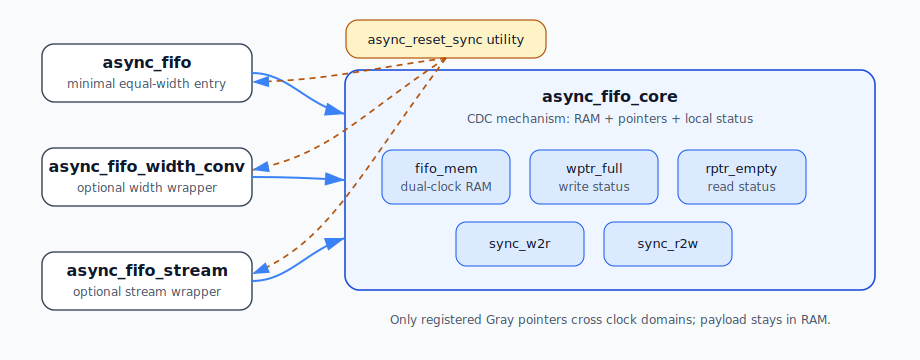
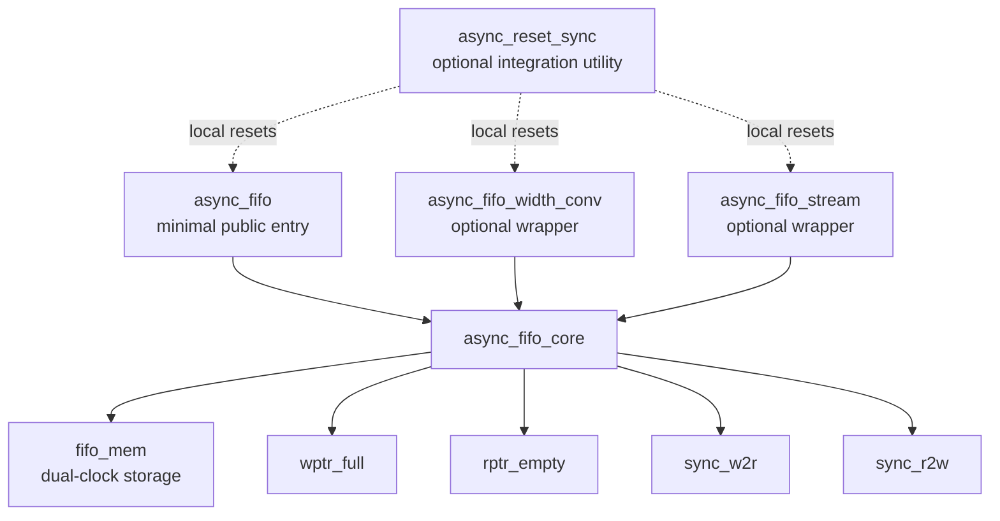

# Architecture

The repository separates the smallest user-facing FIFO from optional protocol
wrappers and CDC implementation details:

## Directory ownership

| Directory | Responsibility |
|---|---|
| [`rtl/async_fifo.v`](../rtl/async_fifo.v) | Stable, minimal equal-width user entry point |
| [`rtl/core/`](../rtl/core/) | Storage, pointers, Gray-code synchronization, and local status generation |
| [`rtl/wrappers/`](../rtl/wrappers/) | Width conversion and packet-stream protocol behavior |
| [`rtl/util/`](../rtl/util/) | Optional integration helpers that are not part of FIFO data movement |

`async_fifo.v` deliberately contains no CDC algorithm of its own: it preserves
a simple public module name while delegating implementation to
`async_fifo_core`. Both wrappers also instantiate the same equal-width core;
packing, splitting, ready/valid buffering, and packet metadata remain outside
the CDC mechanism.

Only Gray-coded pointers cross through synchronizer chains. Payload data stays
in the dual-clock memory. See [Interface and Timing](interface.md) for port and
status contracts, [Learning Async FIFO](learning_async_fifo.md) for the
step-by-step mechanism, and [CDC Constraints](cdc_constraints.md) for physical
timing requirements.
