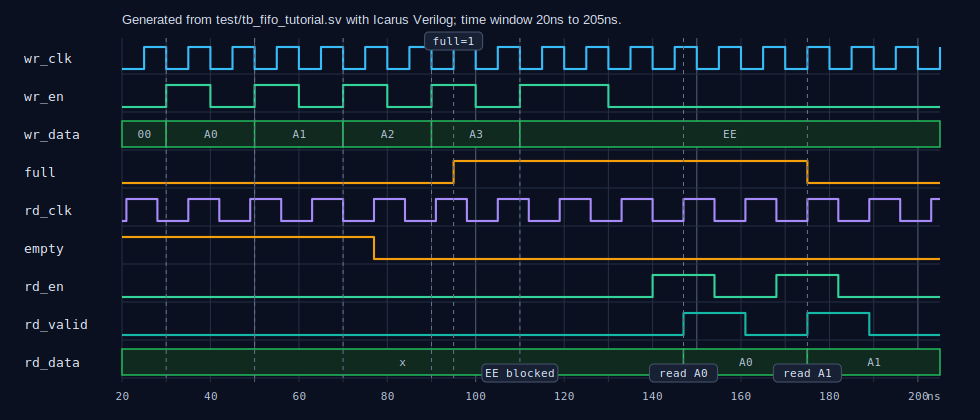

# Async FIFO Step-by-Step Tutorial

This tutorial takes the slow path from “I can use a FIFO” to “I understand why
this async FIFO is built this way”: basic FIFO behavior, Gray pointers,
`full`/`empty`, and the real timing of `rd_valid`.

Its role is to build the first mental model. It intentionally repeats a few
core ideas, but it does not fully cover wrappers, reset policy, CDC
constraints, or the complete interface contract. After this, read
[Learning Async FIFO](learning_async_fifo.md) and
[Interface and Timing](interface.md).

The pointer structure follows the classic Cummings/Sunburst async FIFO style:
local binary pointers, Gray-coded crossing pointers, two-flop synchronizers,
and local-domain full/empty flags. The closest reference for this repository is
Clifford E. Cummings, *Simulation and Synthesis Techniques for Asynchronous
FIFO Design*, SNUG San Jose 2002
([technical-library entry](https://www.sunburst-design.com/papers/CummingsSNUG2002SJ_FIFO1.pdf)).

## 1. Start with a basic FIFO

A synchronous FIFO has a simple mental model:

```text
write side                       read side
----------                       ---------
wr_en, wr_data  --->  RAM  --->  rd_en, rd_data
```

Because it usually has one clock, the internals can directly maintain:

- `wptr`: the next write location;
- `rptr`: the next read location;
- `used = wptr - rptr`: how many valid entries are stored.

Whenever `wr_en && !full`, the write pointer advances by one. Whenever
`rd_en && !empty`, the read pointer advances by one. The low pointer bits
address the RAM.

This repository includes a minimal synchronous FIFO example:

- [`examples/basic_fifo/basic_fifo.v`](../examples/basic_fifo/basic_fifo.v)
- [`examples/basic_fifo/README.md`](../examples/basic_fifo/README.md)

Once that version feels natural, the async FIFO is easier to understand. The
basic idea is still “data lives in RAM, pointers choose the addresses.” The
harder part is comparing pointers across two unrelated clocks.

## 2. Async FIFO cannot directly compare binary pointers

An async FIFO has two independent clocks:

```text
write clock domain                 read clock domain
------------------                 -----------------
wr_clk, wptr  --->  FIFO RAM  ---> rd_clk, rptr
```

The write side needs the read pointer to know whether space is available. The
read side needs the write pointer to know whether data is available. But binary
pointers cannot be synchronized directly because one increment can toggle
multiple bits:

```text
011 -> 100
```

If the destination clock samples while those bits are changing, it may observe
a mixed value that was never the old pointer or the new pointer.

So the async FIFO follows two rules:

- local arithmetic still uses binary pointers, because addition and RAM
  addressing are easy in binary;
- before a pointer crosses a clock boundary, it is converted to a Gray pointer.

## 3. What the Gray pointer does

Gray code has one key property: adjacent count values differ by one bit.

```text
binary: 000 001 010 011 100 101 110 111
gray:   000 001 011 010 110 111 101 100
```

After synchronization, the receiver is much more likely to see the old value
or the new value, not an unrelated multi-bit mixture. Gray code is not magic:
the design still needs two-flop synchronizers and CDC constraints.

The structure in this project is:

```text
write binary pointer -> write Gray pointer -> sync_w2r -> read domain
read  binary pointer -> read  Gray pointer -> sync_r2w -> write domain
```

Relevant RTL:

- [`rtl/core/wptr_full.v`](../rtl/core/wptr_full.v)
- [`rtl/core/rptr_empty.v`](../rtl/core/rptr_empty.v)
- [`rtl/core/sync_w2r.v`](../rtl/core/sync_w2r.v)
- [`rtl/core/sync_r2w.v`](../rtl/core/sync_r2w.v)

## 4. Why the pointer has one extra bit

If `ADDR_WIDTH = 2`, the RAM depth is `2**2 = 4`, and the address has only two
bits:

```text
00, 01, 10, 11
```

But the FIFO pointer uses `ADDR_WIDTH + 1 = 3` bits:

```text
000, 001, 010, 011, 100, ...
```

The low two bits address RAM. The high bit is the wrap bit. It distinguishes:

- `wptr == rptr` because the FIFO is empty;
- the writer has wrapped around and caught the same low address bits, so the
  FIFO is full.

Without the extra bit, `empty` and `full` would be ambiguous when the low
address bits match.

## 5. Where empty comes from

`empty` is a read-clock-domain status signal. The read side owns `rptr`, and it
receives the write-side pointer as `wptr_gray_sync` through a synchronizer.

The read side predicts what the next read pointer would be if this cycle
accepted a read request. If that next read Gray pointer equals the synchronized
write Gray pointer, no unread data remains from the read side's point of view:

```text
next read Gray pointer == synchronized write Gray pointer
```

This is why `empty` may deassert a few read clocks after the physical write
already happened. The data is in RAM first; the write pointer then has to cross
into the read domain before the read side can safely know it is available.

## 6. Where full comes from

`full` is a write-clock-domain status signal. The write side owns `wptr`, and
it receives the read-side pointer as `rptr_gray_sync` through a synchronizer.

The write side predicts the next write pointer. If that next pointer would be
one FIFO depth ahead of the synchronized read pointer, another write would
overwrite unread data and must be blocked:

```text
next write pointer is one FIFO depth ahead of synchronized read pointer
```

In Gray code, that comparison is expressed as:

```text
next wptr_gray == {inverted two MSBs of synced rptr_gray, remaining bits equal}
```

The expression is less friendly than the idea. The goal is simply: the writer
must stop before it overwrites data that the reader has not consumed.

## 7. A real waveform

The waveform below comes from a real simulation, not a hand-drawn timing
sketch. The testbench is
[`test/tb_fifo_tutorial.sv`](../test/tb_fifo_tutorial.sv). It uses a depth-4
async FIFO:

- `wr_clk` period is 10ns;
- `rd_clk` period is 14ns;
- it writes `A0`, `A1`, `A2`, `A3`, filling the FIFO;
- after `full=1`, it keeps trying to write `EE`, which is not accepted;
- it reads twice and returns `A0`, then `A1`.



Regenerate the VCD with:

```sh
make tutorial
```

The target runs the same commands shown below:

```sh
mkdir -p build
iverilog -g2012 -Wall -s tb_fifo_tutorial \
  -o build/tb_fifo_tutorial.out \
  -f rtl/files.f test/tb_fifo_tutorial.sv
vvp build/tb_fifo_tutorial.out
```

The output file is `build/tutorial_async_fifo.vcd`.

## 8. Cycle-by-cycle waveform explanation

Read the waveform by focusing on `wr_en`, `rd_en`, `full`, `empty`, and
`rd_valid`.

| Time | Signal change | Meaning |
|---:|---|---|
| 30ns | `wr_en=1`, `wr_data=A0` | The write side accepts the first write on the next active `wr_clk` edge. `full=0`, so A0 enters RAM. |
| 50ns | `wr_en=1`, `wr_data=A1` | The second write is accepted. The write pointer advances. |
| 70ns | `wr_en=1`, `wr_data=A2` | The third write is accepted. Nothing has been read yet, so the FIFO is filling. |
| 77ns | `empty` goes from 1 to 0 | The read side finally sees available data through the synchronized write Gray pointer. A0 was already in RAM, but `empty` waits for CDC latency. |
| 90ns | `wr_en=1`, `wr_data=A3` | The fourth write is accepted, filling the depth-4 FIFO. |
| 95ns | `full` goes from 0 to 1 | The write side predicts that another write would catch the read pointer, so it asserts `full`. |
| 110ns-130ns | `wr_en=1`, `wr_data=EE`, `full=1` | The producer keeps requesting an EE write, but the FIFO is full. Internally, `write_allow = wr_en && !full`, so EE does not enter the FIFO. |
| 140ns-154ns | `rd_en=1`, `empty=0` | The read side requests a read and the FIFO is not empty, so the read is accepted. |
| 147ns | `rd_valid=1`, `rd_data=A0` | The synchronous RAM returns A0 after the read clock edge, and `rd_valid` marks `rd_data` as valid. |
| 168ns-182ns | `rd_en=1`, `empty=0` | The second read request is accepted. |
| 175ns | `rd_valid=1`, `rd_data=A1` | The second returned word, A1, is valid. |
| 175ns | `full` goes from 1 to 0 | After the read pointer crosses back into the write domain, the write side sees that space was freed. `full` does not deassert at the exact instant of the read. |

The important lessons:

- `wr_en` and `rd_en` are requests; acceptance also requires `!full` or
  `!empty`;
- `full` belongs to `wr_clk`; `empty` and `rd_valid` belong to `rd_clk`;
- synchronized pointers add latency, so `empty` and `full` change
  conservatively.

## 9. Map the tutorial back to RTL

Read the implementation in this order:

1. [`rtl/core/fifo_mem.v`](../rtl/core/fifo_mem.v): how RAM is written and read.
2. [`rtl/core/wptr_full.v`](../rtl/core/wptr_full.v): how the write pointer advances and predicts `full`.
3. [`rtl/core/rptr_empty.v`](../rtl/core/rptr_empty.v): how the read pointer advances and predicts `empty`.
4. [`rtl/core/sync_w2r.v`](../rtl/core/sync_w2r.v): how the write Gray pointer enters the read domain.
5. [`rtl/core/sync_r2w.v`](../rtl/core/sync_r2w.v): how the read Gray pointer enters the write domain.
6. [`rtl/core/async_fifo_core.v`](../rtl/core/async_fifo_core.v): how RAM, pointers, and synchronizers connect.

Keep this model in mind:

```text
data goes through RAM; control crosses as Gray pointers; full/empty are local,
conservative clock-domain status signals.
```

For deeper theory, read [Learning Async FIFO](learning_async_fifo.md), then
compare the pointer and flag modules with the Cummings paper.
