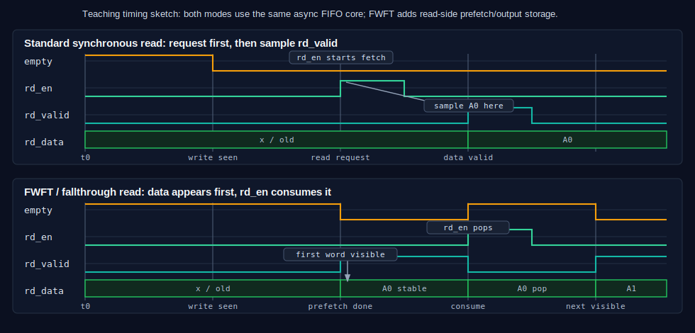

# Async FIFO 逐步教程

这篇 tutorial 按“先会用，再理解为什么”的顺序走一遍：从最普通的 basic FIFO，
到异步 FIFO 里的 Gray pointer，再到 `full`、`empty`、`rd_valid` 的真实时序。

它的定位是“第一遍跑通心智模型”：会有少量必要概念重复，但不展开 wrapper、复位、
CDC 约束和完整接口契约。读完这篇后，再看[学习异步 FIFO](learning_async_fifo_CN.md)
和[接口与时序](interface.md)会更顺。

本仓库的指针结构参考 Cummings/Sunburst 经典异步 FIFO 风格：本地二进制指针、跨域
格雷码指针、两级同步器，以及本地时钟域产生的 `full`/`empty`。最贴近本仓库实现的
参考是 Clifford E. Cummings, *Simulation and Synthesis Techniques for
Asynchronous FIFO Design*, SNUG San Jose 2002
（[技术库条目](https://www.sunburst-design.com/papers/CummingsSNUG2002SJ_FIFO1.pdf)）。

## 1. 先从 basic FIFO 开始

同步 FIFO 的最小心智模型很简单：

```text
write side                       read side
----------                       ---------
wr_en, wr_data  --->  RAM  --->  rd_en, rd_data
```

它通常只有一个时钟，所以内部可以直接维护：

- `wptr`：下一次写入的位置；
- `rptr`：下一次读出的位置；
- `used = wptr - rptr`：FIFO 里有多少个有效数据。

每当 `wr_en && !full`，写指针前进一格。每当 `rd_en && !empty`，读指针前进
一格。RAM 地址来自指针低位。

这个仓库里有一个最小同步 FIFO 例子：

- [`examples/basic_fifo/basic_fifo.v`](../examples/basic_fifo/basic_fifo.v)
- [`examples/basic_fifo/README.md`](../examples/basic_fifo/README.md)

先理解这个版本，再看异步 FIFO 会轻松很多。异步 FIFO 没有改变“数据放 RAM、指针
决定地址”这个核心，只是把“怎样在两个时钟域之间比较指针”变复杂了。

## 2. 异步以后，不能直接比较两个二进制指针

异步 FIFO 有两个互不相关的时钟：

```text
写时钟域                         读时钟域
--------                         --------
wr_clk, wptr  --->  FIFO RAM  ---> rd_clk, rptr
```

写侧需要知道读指针，才能判断有没有空间；读侧需要知道写指针，才能判断有没有数据。
但二进制指针不能直接跨时钟域同步，因为一次递增可能翻转多个 bit：

```text
011 -> 100
```

如果读时钟刚好采到这些 bit 正在变化的瞬间，可能看到一个混合值。这个值既不是旧
指针，也不是新指针。

所以异步 FIFO 采用两个规则：

- 本地计算仍然用二进制指针，因为加减和 RAM 寻址方便；
- 跨时钟域之前，把二进制指针转换成 Gray pointer。

## 3. Gray pointer 的作用

Gray code 的关键性质是：相邻计数值只变化一个 bit。

```text
binary: 000 001 010 011 100 101 110 111
gray:   000 001 011 010 110 111 101 100
```

这样同步到另一个时钟域时，接收端看到的通常是旧值或新值，而不是一个乱跳的多 bit
混合值。注意：Gray code 不是魔法，它仍然需要两级同步器和 CDC 约束配合。

本项目里的结构是：

```text
write binary pointer -> write Gray pointer -> sync_w2r -> read domain
read  binary pointer -> read  Gray pointer -> sync_r2w -> write domain
```

对应 RTL：

- [`rtl/core/wptr_full.v`](../rtl/core/wptr_full.v)
- [`rtl/core/rptr_empty.v`](../rtl/core/rptr_empty.v)
- [`rtl/core/sync_w2r.v`](../rtl/core/sync_w2r.v)
- [`rtl/core/sync_r2w.v`](../rtl/core/sync_r2w.v)

## 4. 为什么指针要多一位

如果 `ADDR_WIDTH = 2`，RAM 深度是 `2**2 = 4`，地址只有两位：

```text
00, 01, 10, 11
```

但是 FIFO 指针会用 `ADDR_WIDTH + 1 = 3` 位：

```text
000, 001, 010, 011, 100, ...
```

低两位给 RAM 当地址，高一位是 wrap bit。它用来区分：

- `wptr == rptr`，因为 FIFO 是空的；
- 写指针绕了一圈，低地址位又追上读指针，FIFO 是满的。

没有这个额外 bit，`empty` 和 `full` 会在地址低位相等时混在一起。

## 5. empty 怎么来

`empty` 是读时钟域里的状态。读侧拥有自己的 `rptr`，并通过同步器拿到写侧的
`wptr_gray_sync`。

读侧每拍预测“如果这拍接受读请求，下一拍读指针会是什么”。如果下一拍读 Gray
pointer 等于同步过来的写 Gray pointer，说明从读侧视角看已经没有未读数据：

```text
next read Gray pointer == synchronized write Gray pointer
```

所以 `empty` 的撤销会比真实写入晚几拍。写侧已经把数据写进 RAM 以后，写指针还要
先跨到读时钟域，读侧才能安全地知道“现在可读了”。

## 6. full 怎么来

`full` 是写时钟域里的状态。写侧拥有自己的 `wptr`，并通过同步器拿到读侧的
`rptr_gray_sync`。

写侧预测下一次写指针。如果下一次写指针刚好领先同步后的读指针一个 FIFO 深度，
就说明再写会覆盖未读数据，必须停：

```text
next write pointer is one FIFO depth ahead of synchronized read pointer
```

在 Gray code 里，这个比较表现为：

```text
next wptr_gray == {inverted two MSBs of synced rptr_gray, remaining bits equal}
```

这个表达式看起来比概念绕，但目的只有一个：写侧宁愿保守一点，也不能覆盖还没被
读走的数据。

## 7. 一张真实 waveform

下面这张图来自真实仿真，不是手画时序图。生成它的 testbench 是
[`test/tb_fifo_tutorial.sv`](../test/tb_fifo_tutorial.sv)，场景是一个深度为 4 的
异步 FIFO：

- `wr_clk` 周期 10ns；
- `rd_clk` 周期 14ns；
- 写入 `A0`、`A1`、`A2`、`A3`，把 FIFO 写满；
- `full=1` 后继续尝试写 `EE`，这次写不会被接受；
- 读两次，得到 `A0`、`A1`。


可以用下面命令重新生成 VCD：

```sh
make tutorial
```

这个 target 运行的就是下面这些底层命令：

```sh
mkdir -p build
iverilog -g2012 -Wall -s tb_fifo_tutorial \
  -o build/tb_fifo_tutorial.out \
  -f rtl/files.f test/tb_fifo_tutorial.sv
vvp build/tb_fifo_tutorial.out
```

输出文件是 `build/tutorial_async_fifo.vcd`。

## 8. 逐拍解释这张 waveform

这里按仿真时间逐段看，重点观察 `wr_en`、`rd_en`、`full`、`empty`、`rd_valid`。

| 时间 | 信号变化 | 发生了什么 |
|---:|---|---|
| 30ns | `wr_en=1`, `wr_data=A0` | 写侧在下一个 `wr_clk` 有效沿接受第一笔写入。此时 `full=0`，所以 A0 写入 RAM。 |
| 50ns | `wr_en=1`, `wr_data=A1` | 第二笔写入被接受。写指针继续前进。 |
| 70ns | `wr_en=1`, `wr_data=A2` | 第三笔写入被接受。读侧还没读，所以 FIFO 越来越满。 |
| 77ns | `empty` 从 1 变 0 | 读侧终于通过同步后的写 Gray pointer 看到“已有数据”。注意 A0 早已写入，但 `empty` 要等跨域同步后才撤销。 |
| 90ns | `wr_en=1`, `wr_data=A3` | 第四笔写入被接受，深度 4 的 FIFO 被写满。 |
| 95ns | `full` 从 0 变 1 | 写侧预测下一次写会追上读指针，于是置位 `full`。 |
| 110ns-130ns | `wr_en=1`, `wr_data=EE`, `full=1` | 外部仍在请求写入 EE，但 FIFO 已满。内部 `write_allow = wr_en && !full`，所以 EE 不会进入 FIFO。 |
| 140ns-154ns | `rd_en=1`, `empty=0` | 读侧请求读，并且 FIFO 非空，所以这次读被接受。 |
| 147ns | `rd_valid=1`, `rd_data=A0` | 同步 RAM 在读时钟沿给出 A0，`rd_valid` 同拍说明 `rd_data` 有效。 |
| 168ns-182ns | `rd_en=1`, `empty=0` | 第二次读请求被接受。 |
| 175ns | `rd_valid=1`, `rd_data=A1` | 第二个数据 A1 有效。 |
| 175ns | `full` 从 1 变 0 | 读指针跨回写时钟域后，写侧知道空间被释放，`full` 撤销。它不会在读发生的同一瞬间立刻撤销。 |

这张图里最值得记住的是三件事：

- `wr_en` 和 `rd_en` 只是请求，真正接受还要看 `!full` 或 `!empty`；
- `full` 属于 `wr_clk` 域，`empty` 和 `rd_valid` 属于 `rd_clk` 域；
- 跨域指针有同步延迟，所以 `empty`/`full` 的撤销或置位是安全但保守的。

## 9. Standard read 和 FWFT read 对比

上面的 waveform 展示的是标准 `async_fifo` 读契约：

```text
rd_en && !empty  请求一次读
rd_valid         标记返回的 rd_data 有效
```

可选的 [`async_fifo_fwft`](../rtl/wrappers/async_fifo_fwft.v) wrapper 保持同一个
Cummings 风格 CDC core，但在读侧增加 prefetch 存储。这样用户看到的读契约变成：

```text
rd_valid == 1      rd_data 上已经有可见数据
rd_en && rd_valid  消费当前可见数据
empty == !rd_valid
```



核心差异是“谁发起第一次读”。standard 模式下，用户等待 `empty=0`，拉高
`rd_en`，然后在 `rd_valid` 脉冲时采样 `rd_data`。FWFT 模式下，wrapper 自己发起
内部读；经过指针同步和 RAM fetch 后，`rd_valid` 拉高，`rd_data` 保持稳定，直到
用户用 `rd_en` 消费它。

所以 FWFT 的读侧更接近 valid/ready 输出：

- standard 模式：先请求，再收到数据；
- FWFT 模式：先看到有效数据，再 pop 它。

底层 CDC 安全逻辑不变。数据仍然保存在双时钟 RAM 中，跨域的仍然只有 Gray
pointer。FWFT 只是包在 core 外面的读侧行为层。

## 10. 把它映射回 RTL

你可以按下面顺序读代码：

1. [`rtl/core/fifo_mem.v`](../rtl/core/fifo_mem.v)：只看 RAM 如何写入和读出。
2. [`rtl/core/wptr_full.v`](../rtl/core/wptr_full.v)：看写指针如何前进，以及 `full` 如何预测。
3. [`rtl/core/rptr_empty.v`](../rtl/core/rptr_empty.v)：看读指针如何前进，以及 `empty` 如何预测。
4. [`rtl/core/sync_w2r.v`](../rtl/core/sync_w2r.v)：看写 Gray pointer 如何进读时钟域。
5. [`rtl/core/sync_r2w.v`](../rtl/core/sync_r2w.v)：看读 Gray pointer 如何进写时钟域。
6. [`rtl/core/async_fifo_core.v`](../rtl/core/async_fifo_core.v)：把 RAM、指针、同步器连起来。

最后记住这句就够了：

```text
数据走 RAM；控制走 Gray pointer；full/empty 在本地时钟域保守地产生。
```

想继续深挖理论时，可以读[学习异步 FIFO](learning_async_fifo_CN.md)，再把指针和
标志模块对照 Cummings 论文看。
